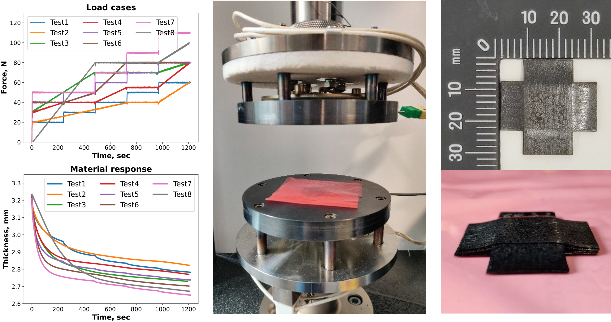
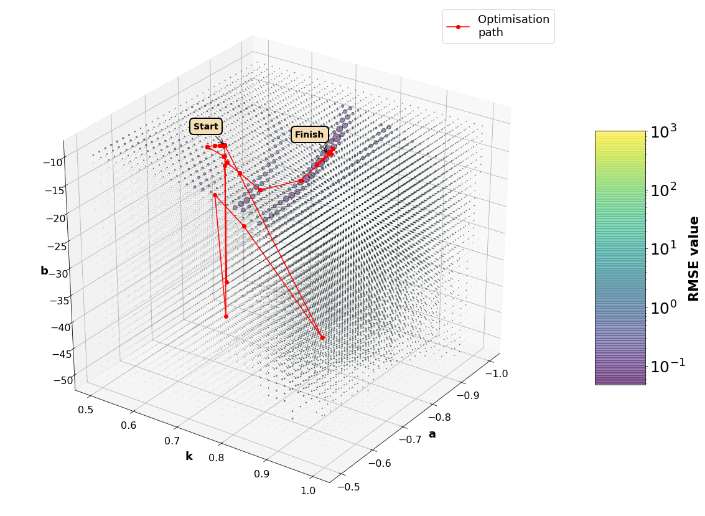

# DefGen Parameter Extraction
This directory contains the implementation of the parameter extraction framework used for the analysis of the compaction data within the DefGen ProToCoL material model.

This work was supported by the Engineering and Physical Sciences Research Council (EPSRC) through the Centre for Doctoral Training in Advanced Composites Collaboration for Innovation and Science (grant number EP/L016028/1) and SIMulation of new manufacturing PROcesses for Composite Structures (SIMPROCS) (grant number EP/P027350/1).

# Access
To receive access to the DefGen Parameter Extraction (DefGenParFit) repository, please send a short email to bci-github@bristol.ac.uk to let us know your interest.  

Access is granted on the condition that you agree for us to contact you about your use of the software.

You can click [here](mailto:bci-github@bristol.ac.uk?subject=Access%20to%20DefGen%20Parameter%20Extraction%20repository&body=Dear%20BCI%2C%20%0A%0AI%20would%20like%20to%20request%20access%20to%20your%20GitHub%20repository%20for%20DefGenParFit.%20%0A%0ABest%20wishes%2C%20%0A%3Cname%3E%0A%3Coptional%20affiliation%3E) for an email template.

# Additional details

A full technical description of the parameter extraction process is included in 
the following paper
* A. Koptelov, J. P. H. Belnoue, I. Georgilas, S. R. Hallett, D. S. Ivanov, “Revising testing of composite precursors – a new framework for data capture in complex multi-material systems”, Composites Part A

Optimisation based on the LMFIT Library
* M. Newville, T. Stensitzki, D. B. Allen, and A. Ingargiola, “LMFIT: Non-Linear Least-Square Minimization and Curve-Fitting for Python,” 2018. doi: 10.5281/zenodo.11813.

A full technical description of the DefGen model is provided in:
* J.P.-H. Belnoue, O.J. Nixon-Pearson, D.S. Ivanov and S.R. Hallett, "A Novel Hyper-Viscoelastic Model for Consolidation of Toughened Prepregs under Processing Conditions", Mechanics of Materials,97:118-134, 2016.

Demonstrations of the DefGen model capabilities are illustrated in:
* J.P.-H. Belnoue, O.J. Nixon-Pearson, A. Thompson, D.S. Ivanov, K.D. Potter and S.R. Hallett, "Consolidation-driven defect generation in thick composite parts", Journal of Manufacturing Science and Engineering, in press, doi:10.1115/1.4039555, 2018.
* J.P.-H. Belnoue, T. Mesogitis, O.J. Nixon-Pearson, J. Kratz, D.S. Ivanov, I.K. Partridge, K.D. Potter and S.R. Hallett, "Understanding and predicting defect formation in automated fibre placement pre-preg laminates", Composites Part A: Applied Science and Manufacturing, 102:196-206, 2017.

For more information please contact the Bristol Composites Institute: bci-github@bristol.ac.uk . 

# Graphical Abstract

