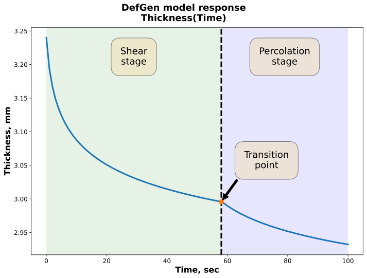

# DefGen 1D model
This directory contains all the files of the DefGen ProToCoL material model (Python implementation) for the modelling of the toughened prepregs’ compaction response under processing conditions.

This work was supported by the Engineering and Physical Sciences Research Council (EPSRC) through the Centre for Doctoral Training in Advanced Composites Collaboration for Innovation and Science (grant number EP/L016028/1) and SIMulation of new manufacturing PROcesses for Composite Structures (SIMPROCS) (grant number EP/P027350/1).

# Access
To receive access to the DefGen_1D repository, please send a short email to bci-github@bristol.ac.uk to let us know your interest.  

Access is granted on the condition that you agree for us to contact you about your use of the software.

You can click [here](mailto:bci-github@bristol.ac.uk?subject=Access%20to%20DefGen_1D%20repository&body=Dear%20BCI%2C%20%0A%0AI%20would%20like%20to%20request%20access%20to%20your%20GitHub%20repository%20for%20DefGen_1D.%20%0A%0ABest%20wishes%2C%20%0A%3Cname%3E%0A%3Coptional%20affiliation%3EE) for an email template.

# Additional details

 A full technical description of the model is provided in:
* J.P.-H. Belnoue, O.J. Nixon-Pearson, D.S. Ivanov and S.R. Hallett, "A Novel Hyper-Viscoelastic Model for Consolidation of Toughened Prepregs under Processing Conditions", Mechanics of Materials,97:118-134, 2016.
* J. P. Belnoue, M. A. Valverde, M. Onoufriou, X. R. Sun, D. S. Ivanov, and S. R. Hallett, “On the physical relevance of power law-based equations to describe the compaction behaviour of resin infused fibrous materials,” Int. J. Mech. Sci., vol. 199, 2021, doi: 10.1016/j.ijmecsci.2021.106425.

Demonstrations of the model capabilities are illustrated in:
* J.P.-H. Belnoue, O.J. Nixon-Pearson, A. Thompson, D.S. Ivanov, K.D. Potter and S.R. Hallett, "Consolidation-driven defect generation in thick composite parts", 
Journal of Manufacturing Science and Engineering, in press, doi:10.1115/1.4039555, 2018.
* J.P.-H. Belnoue, T. Mesogitis, O.J. Nixon-Pearson, J. Kratz, D.S. Ivanov, I.K. Partridge, K.D. Potter and S.R. Hallett, "Understanding and predicting defect formation in automated fibre 
placement pre-preg laminates", Composites Part A: Applied Science and Manufacturing, 102:196-206, 2017.

For more information please contact the Bristol Composites Institute: bci-github@bristol.ac.uk . 

# Graphical Abstract

